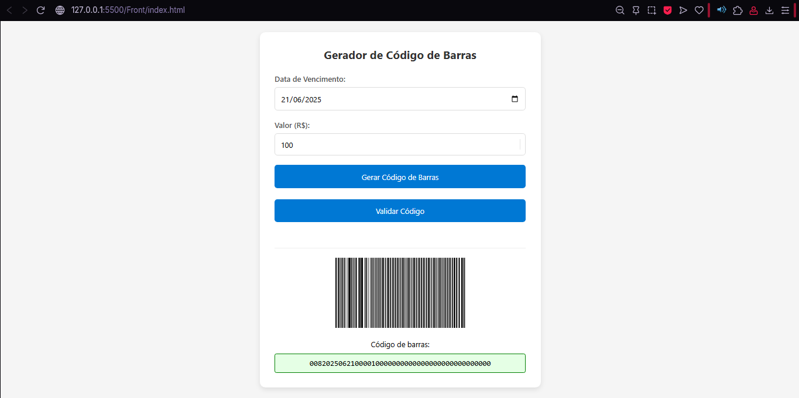

# Gerador e Validador de Código de Barras

Este projeto consiste em uma aplicação web simples para gerar e validar códigos de barras, ideal para simular processos de boletos bancários. O front-end é construído com HTML, CSS e JavaScript, enquanto a validação do código de barras é feita por uma Azure Function em C#.

## Visão Geral do Projeto

O objetivo principal deste projeto é demonstrar a integração entre um front-end web e um back-end serverless (Azure Functions) para realizar operações de geração e validação de dados. Embora a geração do código de barras em si dependa de uma API externa (não fornecida neste repositório, mas simulada na chamada front-end), a parte de validação é totalmente implementada na Azure Function.

### Funcionalidades

* **Geração de Código de Barras**: Permite ao usuário inserir uma data de vencimento e um valor para "gerar" um código de barras. (Nota: A geração da imagem e do texto do código de barras é simulada com uma chamada a uma API externa `http://localhost:7999/api/barcode-generate`).
* **Validação de Código de Barras**: O código de barras gerado (ou qualquer outro código de 44 dígitos) pode ser validado pela Azure Function, que verifica seu formato e a validade da data de vencimento embutida.
* **Feedback Visual**: A interface de usuário indica claramente se o código de barras é válido ou inválido através de estilos CSS.

## Tecnologias Utilizadas

* **Front-end**:
    * HTML5
    * CSS3
    * JavaScript (ES6+)
* **Back-end (Validação)**:
    * Azure Functions (.NET Isolated Process)
    * C#
    * Newtonsoft.Json (para manipulação JSON)

## Estrutura do Projeto
├── Function1.cs             # Lógica da Azure Function para validação de código de barras
├── host.json                # Configurações do host da Azure Function
├── index.html               # Página HTML principal da aplicação web
├── local.settings.json      # Configurações locais para a Azure Function (inclui CORS)
├── Program.cs               # Ponto de entrada da Azure Function
├── script.js                # Lógica JavaScript para o front-end
└── styles.css               # Estilos CSS da aplicação web

## Screenshots

### Tela de Gerador de Boletos


### Tela de Validador de Boletos


## Como Rodar o Projeto Localmente

Para executar este projeto em sua máquina local, siga os passos abaixo:

### 1. Pré-requisitos

* Node.js e npm (para o front-end)
* .NET SDK (para a Azure Function)
* Azure Functions Core Tools (para rodar a função localmente)

### 2. Configuração do Front-end

1.  Navegue até o diretório onde `index.html`, `script.js` e `styles.css` estão localizados.
2.  Você pode abrir o `index.html` diretamente em seu navegador. Para uma melhor experiência de desenvolvimento (especialmente com as chamadas de API), recomenda-se usar um servidor web simples, como o Live Server do VS Code ou o `http-server` do npm:
    ```bash
    # Se você não tiver o http-server instalado
    npm install -g http-server
    # Inicie o servidor na pasta do projeto
    http-server . -p 8080
    ```
    Em seguida, acesse `http://localhost:8080` no seu navegador.

### 3. Configuração e Execução da Azure Function

1.  Navegue até a pasta raiz do projeto que contém `Function1.cs`, `host.json`, etc.
2.  Restaure as dependências do projeto:
    ```bash
    dotnet restore
    ```
3.  Compile o projeto:
    ```bash
    dotnet build
    ```
4.  Inicie a Azure Function localmente. Certifique-se de que a porta `7031` esteja livre, pois é a porta que o front-end espera para a validação.
    ```bash
    func start
    ```
    Você verá a URL da função de validação no console, algo como `http://localhost:7031/api/barcode-validate`.

### 4. Testando a Aplicação

1.  Com o front-end e a Azure Function rodando, abra a aplicação web no seu navegador.
2.  Preencha a "Data de Vencimento" e o "Valor".
3.  Clique em "Gerar Código de Barras". **Atenção**: Como a API de geração (`http://localhost:7999/api/barcode-generate`) não está inclusa neste repositório, esta etapa falhará se você não tiver essa API rodando em segundo plano. Para contornar, você pode:
    * **Opção 1 (Recomendado para teste):** Edite manualmente o campo de texto `<p id="barcodeText" class="code"></p>` no `index.html` (via inspecionar elemento no navegador) ou via console do navegador para um código de barras de 44 dígitos antes de clicar em "Validar Código". Por exemplo, `00000000000000000000000000000000000000000000`.
    * **Opção 2 (Avançado):** Implemente uma API simples em `localhost:7999` para simular a geração do código de barras.
4.  Após ter um código no campo "Código de barras:", clique em "Validar Código".
5.  Observe a cor da borda e do fundo do campo do código de barras para ver o resultado da validação (verde para válido, vermelho para inválido).

## Insights e Possibilidades de Melhoria

Este projeto serviu como um excelente ponto de partida para entender a integração entre front-end e Azure Functions. Durante o desenvolvimento e replicação, alguns insights e possibilidades de melhoria surgiram:

* **Implementação da Geração do Código de Barras**: A parte de geração do código de barras está atualmente simulada. Uma melhoria significativa seria implementar a lógica de geração do código de barras (e da imagem) no back-end (via outra Azure Function ou um serviço dedicado), seguindo as especificações de boletos bancários brasileiros (FEBRABAN).
* **Validação Mais Robusta**: A Azure Function de validação atualmente verifica o comprimento e a data de vencimento. Para um sistema real, seria necessário implementar a validação do dígito verificador (DV) do código de barras, conforme as regras da FEBRABAN, e outras verificações de formato.
* **Tratamento de Erros no Front-end**: Melhorar o feedback visual para o usuário em caso de erros na chamada das APIs (além do `alert()` atual), talvez com mensagens mais amigáveis na UI.
* **Testes Automatizados**: Adicionar testes unitários para a lógica da Azure Function e testes de integração para o fluxo completo da aplicação.
* **Dockerização**: Empacotar o front-end e/ou a Azure Function em contêineres Docker para facilitar o deployment e a consistência do ambiente.
* **Implantação na Azure**: Realizar a implantação completa da Azure Function na nuvem, configurando Application Insights para monitoramento e talvez um Azure Static Web Apps para o front-end.
* **Design da UI/UX**: Embora funcional, o design pode ser aprimorado para oferecer uma experiência de usuário mais rica e intuitiva.

## Conclusão

Este projeto demonstra a facilidade de construir aplicações modernas e escaláveis utilizando Azure Functions para a lógica de back-end e tecnologias web padrão para o front-end. É um excelente ponto de partida para explorar o desenvolvimento serverless e a integração entre diferentes serviços.

## Contribuição

Sinta-se à vontade para fazer um fork deste repositório, implementar melhorias e enviar pull requests!
